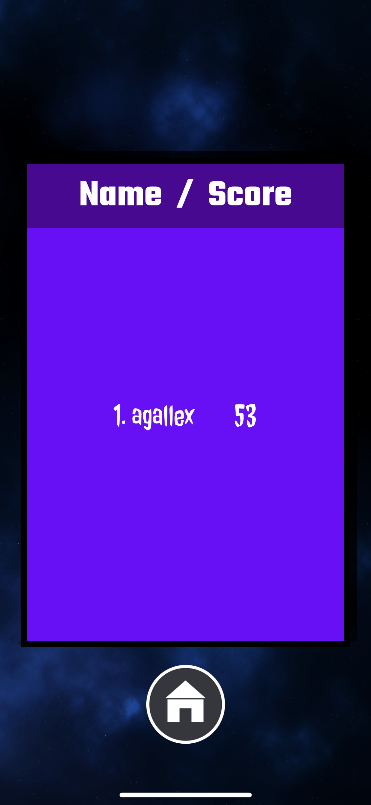
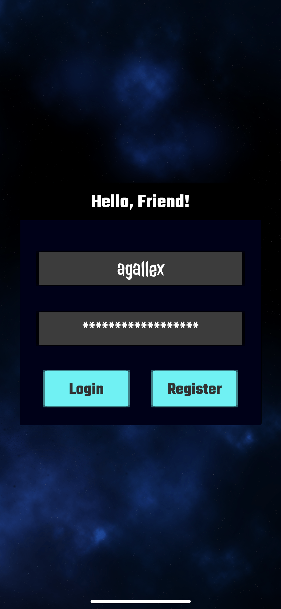

# SpaceInvaders
Сделал игрушку на Юнити с таблицей рекордов.

На ветке UnityProject находится проект Юнити для IOS и Android устройств и установочный файл .apk. [Ссылка на скачивание .apk.](https://github.com/agallex/SpaceInvaders/blob/UnityProject/SpaceInvaders.apk)

Можете склонировать репозиторий и открыть проект в Юнити. Не забудьте скачать и установить пакеты. Ссылка на скачивание пакетов: https://firebase.google.com/download/unity?authuser=0&hl=en. Установите пакеты .Auth и .Database.

Управление:
В редакторе Юнити можете двигаться вправо-влево с помощью кнопок A и D или стрелочек, стрелять на пробел (было сделано для удобства тестирования).
Можно сбилдить проект с помощью Xcode, и поиграть на телефоне. Там управление только сенсорными кнопками.
Делитесь своими рекордами)))

Screenshots: Gameplay/Leaderboard/Menu/Registration.

I made a game on Unity with a table of records.

The UnityProject branch contains the Unity project for iOS and Android devices and the .apk installation file. [Download link .apk.](https://github.com/ag alex/Space Invaders/blob/Unity Project/Space Invaders.apk)

You can clone the repository and open the project in Unity. Don't forget to download and install packages. Link to download packages: https://firebase.google.com/download/unity?authuser=0&hl=en. Install the packages .Auth and .Database.

Management:
In the Unity editor, you can move right and left using the A and D buttons or arrows, shoot at the space bar (this was done for the convenience of testing).
You can build a project using Xcode, and play on your phone. There is control only by touch buttons.
Share your records)))
